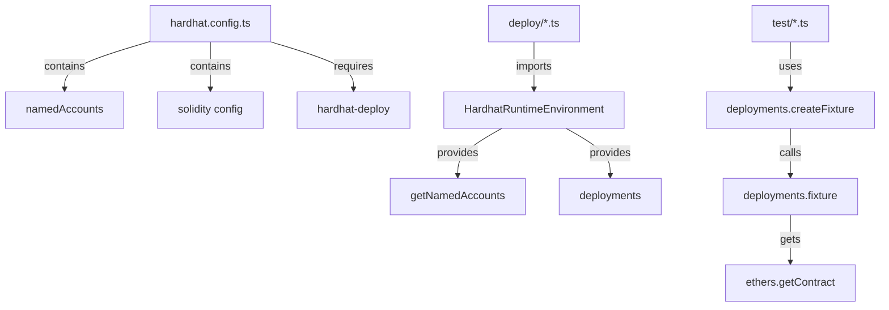

# SKILL: Migrate hardhat-deploy v1 to v2

This guide provides comprehensive instructions for migrating projects from hardhat-deploy v1 to v2. It's designed for AI assistants to understand and execute the migration process systematically.

> **Note**: For complete working examples, see the [template-ethereum-contracts](https://github.com/wighawag/template-ethereum-contracts) repository which demonstrates a full hardhat-deploy v2 setup.

## Table of Contents

1. [Introduction](#introduction)
2. [Prerequisites Check](#prerequisites-check)
3. [Architecture Comparison](#architecture-comparison)
4. [Step-by-Step Migration](#step-by-step-migration)
5. [Common Patterns & Examples](#common-patterns--examples)
6. [Troubleshooting Guide](#troubleshooting-guide)
7. [Migration Checklist](#migration-checklist)
8. [Advanced Topics](#advanced-topics)

---

## Introduction

### Overview

hardhat-deploy v2 is a complete rewrite that requires Hardhat 3.x and introduces significant architectural changes:

- **ESM Modules**: v2 uses native ES modules (`import`/`export`) instead of CommonJS
- **Rocketh Integration**: v2 integrates with the rocketh ecosystem for deployment management
- **Configuration Changes**: Named accounts moved from hardhat.config.ts to rocketh/config.ts
- **Plugin System**: Enhanced extensibility through rocketh extensions

### Key Differences Summary

| Aspect                   | v1 Pattern                            | v2 Pattern                                                 |
| ------------------------ | ------------------------------------- | ---------------------------------------------------------- |
| **Hardhat version**      | 2.x                                   | 3.x (specifically `^3.1.5`)                                |
| **Module system**        | CommonJS (`require`/`module.exports`) | ESM (`import`/`export`)                                    |
| **Named accounts**       | `namedAccounts` in hardhat.config.ts  | `rocketh/config.ts`                                        |
| **Deploy function**      | `deployments.deploy(name, {...})`     | `deploy(name, {account: ..., artifact: ...})`              |
| **Deployer param**       | `from: address`                       | `account: address`                                         |
| **Solidity config**      | `solidity: "0.8.x"`                   | `solidity: {profiles: {default: {version: "..."}}}`        |
| **Test fixtures**        | `deployments.createFixture()`         | Custom fixture with `loadAndExecuteDeploymentsFromFiles()` |
| **Contract interaction** | `ethers.getContract()`                | `env.get()` + `env.execute()`                              |

### When to Stay on v1

If you have a production project using hardhat-deploy v1 with Hardhat 2.x, it's often better to stay on v1:

```bash
npm uninstall hardhat-deploy
npm install hardhat-deploy@1
```

v1 continues to receive security fixes but won't get new features.

---

## Prerequisites Check

Before starting the migration, verify your environment meets these requirements:

### Checklist

```bash
# Check Node.js version (requires 22+ for v2)
node --version

# Check Hardhat version (requires 3.x+ for v2)
npx hardhat --version

# Check if project is using CommonJS or ESM
grep -q '"type": "module"' package.json && echo "ESM" || echo "CommonJS"
```

### Required Versions

- **Node.js**: 22 or higher
- **Hardhat**: 3.x or higher (specifically `^3.1.5` recommended)
- **TypeScript**: 5.x (for TypeScript projects)

### Pre-Migration Assessment

Check for these v1 patterns in your project:

```typescript
// In hardhat.config.ts
- namedAccounts configuration
- require() statements
- module.exports
- solidity: "0.8.x" format

// In deploy scripts
- async function (hre) { ... }
- hre.deployments.deploy()
- hre.getNamedAccounts()
- from: parameter
- log: true parameter

// In tests
- deployments.createFixture()
- ethers.getContract()
- getUnnamedAccounts()
```

---

## Architecture Comparison

### v1 Architecture



**Key Files in v1**:

- `hardhat.config.ts` - Single configuration file
- `deploy/*.ts` - Deploy scripts with HRE pattern
- `test/*.ts` - Tests using deployments fixture
- `utils/network.ts` - Network configuration helper

### v2 Architecture

```mermaid
graph TD
    A[hardhat.config.ts] -->|imports plugins| B[HardhatDeploy]
    A -->|uses helpers| C[addNetworksFromEnv]
    A -->|contains| D[solidity profiles]

    E[rocketh/config.ts] -->|contains| F[accounts config]
    E -->|contains| G[extensions]

    H[rocketh/deploy.ts] -->|exports| I[deployScript]
    H -->|exports| J[artifacts]

    K[rocketh/environment.ts] -->|exports| L[loadEnvironmentFromHardhat]
    K -->|exports| M[loadAndExecuteDeploymentsFromFiles]

    N[deploy/*.ts] -->|imports| I
    N -->|uses| J

    O[test/*.ts] -->|imports| M
    O -->|uses| env.get and env.execute
```

**Key Files in v2**:

- `hardhat.config.ts` - Hardhat configuration (no named accounts)
- `rocketh/config.ts` - Named accounts and extensions
- `rocketh/deploy.ts` - Deploy script setup
- `rocketh/environment.ts` - Environment setup for tests/scripts
- `deploy/*.ts` - Deploy scripts with new pattern
- `test/*.ts` - Tests using new fixture pattern

---

## Step-by-Step Migration

### Step 1: Update Dependencies

Update your `package.json` to use Hardhat 3.x and hardhat-deploy v2:

**v1 package.json example:**

```json
{
	"devDependencies": {
		"hardhat": "^2.22.18",
		"hardhat-deploy": "^0.14.0",
		"hardhat-deploy-ethers": "^0.4.2",
		"hardhat-deploy-tenderly": "^1.0.0",
		"ethers": "^6.13.5",
		"hardhat-deploy": "^0.14.0"
	}
}
```

**v2 package.json example:** (see [template-ethereum-contracts/package.json](https://github.com/wighawag/template-ethereum-contracts/blob/main/contracts/package.json))

```json
{
	"type": "module",
	"devDependencies": {
		"hardhat": "^3.1.4",
		"hardhat-deploy": "^2.0.0",
		"rocketh": "^0.17.15",
		"@rocketh/deploy": "^0.17.9",
		"@rocketh/read-execute": "^0.17.9",
		"@rocketh/node": "^0.17.18",
		"@rocketh/proxy": "^0.17.13",
		"@rocketh/signer": "^0.17.9",
		"viem": "^2.45.0",
		"earl": "^2.0.0",
		"@nomicfoundation/hardhat-viem": "^3.0.1",
		"@nomicfoundation/hardhat-node-test-runner": "^3.0.8",
		"@nomicfoundation/hardhat-network-helpers": "^3.0.3",
		"@nomicfoundation/hardhat-keystore": "^3.0.3"
	}
}
```

**Transformation Rules**:

1. Add `"type": "module"` at the top level
2. Update `hardhat` to `^3.1.4` or higher
3. Update `hardhat-deploy` to `^2.0.0` or higher
4. Remove `hardhat-deploy-ethers` and `hardhat-deploy-tenderly`
5. Add rocketh packages: `rocketh`, `@rocketh/deploy`, `@rocketh/read-execute`, `@rocketh/node`, `@rocketh/signer`
6. Add optional packages: `@rocketh/proxy`, `@rocketh/export`, `@rocketh/verifier`, `@rocketh/doc`
7. Add `viem` for contract interactions
8. Add `earl` for assertions (for node:test)
9. Add Hardhat 3.x plugins

**Install dependencies**:

```bash
pnpm install
```

### Step 2: Restructure Configuration

#### 2.1 Convert hardhat.config.ts

**v1 hardhat.config.ts example:**

```typescript
import 'dotenv/config';
import {HardhatUserConfig} from 'hardhat/types';

import '@nomicfoundation/hardhat-chai-matchers';
import '@nomicfoundation/hardhat-ethers';
import '@typechain/hardhat';

import 'hardhat-deploy';
import 'hardhat-deploy-ethers';
import 'hardhat-deploy-tenderly';

import {node_url, accounts, addForkConfiguration} from './utils/network';

const config: HardhatUserConfig = {
	solidity: {
		compilers: [
			{
				version: '0.8.17',
				settings: {
					optimizer: {
						enabled: true,
						runs: 2000,
					},
				},
			},
		],
	},
	namedAccounts: {
		deployer: 0,
		simpleERC20Beneficiary: 1,
	},
	networks: addForkConfiguration({
		hardhat: {
			initialBaseFeePerGas: 0,
		},
		localhost: {
			url: node_url('localhost'),
			accounts: accounts(),
		},
		mainnet: {
			url: node_url('mainnet'),
			accounts: accounts('mainnet'),
		},
		sepolia: {
			url: node_url('sepolia'),
			accounts: accounts('sepolia'),
		},
	}),
	paths: {
		sources: 'src',
	},
	mocha: {
		timeout: 0,
	},
	external: process.env.HARDHAT_FORK
		? {
				deployments: {
					hardhat: ['deployments/' + process.env.HARDHAT_FORK],
					localhost: ['deployments/' + process.env.HARDHAT_FORK],
				},
			}
		: undefined,
};

export default config;
```

**v2 hardhat.config.ts example:** (see [template-ethereum-contracts/hardhat.config.ts](https://github.com/wighawag/template-ethereum-contracts/blob/main/contracts/hardhat.config.ts))

```typescript
import type {HardhatUserConfig} from 'hardhat/config';

import HardhatNodeTestRunner from '@nomicfoundation/hardhat-node-test-runner';
import HardhatViem from '@nomicfoundation/hardhat-viem';
import HardhatNetworkHelpers from '@nomicfoundation/hardhat-network-helpers';
import HardhatKeystore from '@nomicfoundation/hardhat-keystore';

import HardhatDeploy from 'hardhat-deploy';
import {addForkConfiguration, addNetworksFromEnv, addNetworksFromKnownList} from 'hardhat-deploy/helpers';

const config: HardhatUserConfig = {
	plugins: [HardhatNodeTestRunner, HardhatViem, HardhatNetworkHelpers, HardhatKeystore, HardhatDeploy],
	solidity: {
		profiles: {
			default: {
				version: '0.8.17',
			},
			production: {
				version: '0.8.17',
				settings: {
					optimizer: {
						enabled: true,
						runs: 999999,
					},
				},
			},
		},
	},
	networks:
		// This add the fork configuration for chosen network
		addForkConfiguration(
			// this add a network config for all known chain using kebab-cases names
			// Note that MNEMONIC_<network> (or MNEMONIC if the other is not set) will
			// be used for account
			// Similarly ETH_NODE_URI_<network> will be used for rpcUrl
			// Note that if you set these env variable to have the value: "SECRET" it will be like using:
			//  configVariable('SECRET_ETH_NODE_URI_<network>')
			//  configVariable('SECRET_MNEMONIC_<network>')
			addNetworksFromKnownList(
				// this add network for each respective env var found (ETH_NODE_URI_<network>)
				// it will also read MNEMONIC_<network> to populate the accounts
				// And like above it will use configVariable if set to SECRET
				addNetworksFromEnv(
					// and you can add in your specific network here
					{
						default: {
							type: 'edr-simulated',
							chainType: 'l1',
							accounts: {
								mnemonic: process.env.MNEMONIC || undefined,
							},
						},
					},
				),
			),
		),
	paths: {
		sources: ['src'],
	},
	generateTypedArtifacts: {
		destinations: [
			{
				folder: './generated',
				mode: 'typescript',
			},
		],
	},
};

export default config;
```

**Transformation Rules**:

1. Change from `import 'hardhat-deploy'` to `import HardhatDeploy from 'hardhat-deploy'`
2. Remove `namedAccounts` section entirely
3. Convert `solidity.compilers` to `solidity.profiles`
4. Add `plugins` array with imported plugins
5. Use helper functions from `hardhat-deploy/helpers` for network configuration
6. Add `generateTypedArtifacts` configuration
7. Remove `mocha` timeout configuration (not needed in v2)
8. Remove `external.deployments` configuration (handled differently)
9. Delete `utils/network.ts` file (no longer needed)

#### 2.5 Update tsconfig.json for ESM

**v1 tsconfig.json example:**

```json
{
	"compilerOptions": {
		"target": "es5",
		"module": "commonjs",
		"strict": true,
		"esModuleInterop": true,
		"moduleResolution": "node",
		"forceConsistentCasingInFileNames": true,
		"outDir": "dist"
	},
	"include": ["hardhat.config.ts", "./scripts", "./deploy", "./test", "typechain/**/*"]
}
```

**v2 tsconfig.json example:**

```json
{
	"compilerOptions": {
		"lib": ["es2023"],
		"module": "node16",
		"target": "es2022",
		"moduleResolution": "node16",
		"strict": true,
		"esModuleInterop": true,
		"skipLibCheck": true,
		"sourceMap": true,
		"declaration": true,
		"declarationMap": true,
		"outDir": "dist",
		"rootDir": "."
	},
	"include": ["deploy", "generated"]
}
```

**Create scripts/tsconfig.json:**

```json
{
	"extends": "../tsconfig.json",
	"compilerOptions": {
		"noEmit": true,
		"rootDir": ".."
	},
	"include": ["**/*", "../generated/**/*", "../rocketh/**/*"],
	"exclude": []
}
```

**Create test/tsconfig.json:**

```json
{
	"extends": "../tsconfig.json",
	"compilerOptions": {
		"noEmit": true,
		"rootDir": ".."
	},
	"include": ["**/*", "../generated/**/*", "../rocketh/**/*", "../hardhat.config.ts"],
	"exclude": []
}
```

**Transformation Rules for tsconfig.json**:

1. Update `module` from `commonjs` to `node16`
2. Update `target` from `es5` to `es2022`
3. Update `moduleResolution` from `node` to `node16`
4. Add `lib: ["es2023"]`
5. Add `skipLibCheck: true`
6. Add `sourceMap: true`, `declaration: true`, `declarationMap: true`
7. Change `include` to only `["deploy", "generated"]`
8. Create `scripts/tsconfig.json` extending the main config
9. Create `test/tsconfig.json` extending the main config

#### 2.2 Create rocketh/config.ts

**New file: rocketh/config.ts example:** (see [template-ethereum-contracts/rocketh/config.ts](https://github.com/wighawag/template-ethereum-contracts/blob/main/contracts/rocketh/config.ts))

```typescript
// ----------------------------------------------------------------------------
// Typed Config
// ----------------------------------------------------------------------------
import type {EnhancedEnvironment, UnknownDeployments, UserConfig} from 'rocketh/types';

// this one provide a protocol supporting private key as account
import {privateKey} from '@rocketh/signer';

// we define our config and export it as "config"
export const config = {
	accounts: {
		deployer: {
			default: 0,
		},
		simpleERC20Beneficiary: {
			default: 1,
		},
	},
	data: {},
	signerProtocols: {
		privateKey,
	},
} as const satisfies UserConfig;

// then we import each extensions we are interested in using in our deploy script or elsewhere

// this one provide a deploy function
import * as deployExtension from '@rocketh/deploy';
// this one provide read,execute functions
import * as readExecuteExtension from '@rocketh/read-execute';
// this one provide a deployViaProxy function that let you declaratively
//  deploy proxy based contracts
import * as deployProxyExtension from '@rocketh/proxy';
// this one provide a viem handle to clients and contracts
import * as viemExtension from '@rocketh/viem';

// and export them as a unified object
const extensions = {
	...deployExtension,
	...readExecuteExtension,
	...deployProxyExtension,
	...viemExtension,
};
export {extensions};

// then we also export the types that our config ehibit so other can use it

type Extensions = typeof extensions;
type Accounts = typeof config.accounts;
type Data = typeof config.data;
type Environment = EnhancedEnvironment<Accounts, Data, UnknownDeployments, Extensions>;

export type {Extensions, Accounts, Data, Environment};
```

**Transformation Rules**:

1. Create `rocketh` directory: `mkdir rocketh`
2. Move `namedAccounts` from hardhat.config.ts to `rocketh/config.ts` under `accounts`. A per-network `null` entry (v1: the account does not exist on that network) is kept as is: in v2 too the name is then absent from `env.namedAccounts`/`env.namedSigners` on that network (typed `` `0x${string}` | undefined ``, so scripts must handle `undefined`) and the run starts. Only an explicit `null` means absent: a name with no entry for the network and no `default` still fails with `cannot get account for <name>`.
3. Import required rocketh extensions
4. Export extensions as unified object
5. Export TypeScript types for type safety

#### 2.3 Create rocketh/deploy.ts

**New file: rocketh/deploy.ts example:** (see [template-ethereum-contracts/rocketh/deploy.ts](https://github.com/wighawag/template-ethereum-contracts/blob/main/contracts/rocketh/deploy.ts))

```typescript
import {type Accounts, type Data, type Extensions, extensions} from './config.js';

// ----------------------------------------------------------------------------
// we re-export the artifacts, so they are easily available from the alias
import * as artifacts from '../generated/artifacts/index.js';
export {artifacts};
// ----------------------------------------------------------------------------
// we create the rocketh functions we need by passing the extensions to the
//  setup function
import {setupDeployScripts} from 'rocketh';
const {deployScript} = setupDeployScripts<Extensions, Accounts, Data>(extensions);

export {deployScript};
```

**Transformation Rules**:

1. Import config and extensions from `./config.js`
2. Import generated artifacts from `../generated/artifacts/index.js`
3. Setup deploy scripts using `setupDeployScripts` from rocketh
4. Export `deployScript` and `artifacts`

#### 2.4 Create rocketh/environment.ts

**New file: rocketh/environment.ts example:** (see [template-ethereum-contracts/rocketh/environment.ts](https://github.com/wighawag/template-ethereum-contracts/blob/main/contracts/rocketh/environment.ts))

```typescript
import {type Accounts, type Data, type Extensions, extensions} from './config.js';
import {setupEnvironmentFromFiles} from '@rocketh/node';
import {setupHardhatDeploy} from 'hardhat-deploy/helpers';

// useful for test and scripts, uses file-system
const {loadAndExecuteDeploymentsFromFiles} = setupEnvironmentFromFiles<Extensions, Accounts, Data>(extensions);
const {loadEnvironmentFromHardhat} = setupHardhatDeploy<Extensions, Accounts, Data>(extensions);

export {loadEnvironmentFromHardhat, loadAndExecuteDeploymentsFromFiles};
```

**Transformation Rules**:

1. Import config and extensions from `./config.js`
2. Setup environment functions from `@rocketh/node` and `hardhat-deploy/helpers`
3. Export `loadEnvironmentFromHardhat` for scripts
4. Export `loadAndExecuteDeploymentsFromFiles` for tests

### Step 3: Convert Deploy Scripts

#### 3.1 Simple Deployment

**v1 deploy script example:**

```typescript
import {HardhatRuntimeEnvironment} from 'hardhat/types';
import {DeployFunction} from 'hardhat-deploy/types';
import {parseEther} from 'ethers';

const func: DeployFunction = async function (hre: HardhatRuntimeEnvironment) {
	const {deployments, getNamedAccounts} = hre;
	const {deploy} = deployments;

	const {deployer, simpleERC20Beneficiary} = await getNamedAccounts();

	await deploy('SimpleERC20', {
		from: deployer,
		args: [simpleERC20Beneficiary, parseEther('1000000000')],
		log: true,
		autoMine: true, // speed up deployment on local network (ganache, hardhat), no effect on live networks
	});
};
export default func;
func.tags = ['SimpleERC20'];
```

**v2 deploy script example:** (see [template-ethereum-contracts/deploy/001_deploy_greetings_registry.ts](https://github.com/wighawag/template-ethereum-contracts/blob/main/contracts/deploy/001_deploy_greetings_registry.ts))

```typescript
import {deployScript, artifacts} from '../rocketh/deploy.js';
import {parseEther} from 'viem';

export default deployScript(
	async (env) => {
		const {deployer, simpleERC20Beneficiary} = env.namedAccounts;

		await env.deploy('SimpleERC20', {
			artifact: artifacts.SimpleERC20,
			account: deployer,
			args: [simpleERC20Beneficiary, parseEther('1000000000')],
		});
	},
	{
		tags: ['SimpleERC20'],
	},
);
```

**Transformation Rules**:

1. Remove `HardhatRuntimeEnvironment` and `DeployFunction` imports
2. Import `deployScript` and `artifacts` from `../rocketh/deploy.js`
3. Change `parseEther` from `ethers` to `viem`
4. Wrap function in `deployScript()` call
5. Change parameter from `(hre)` to `(env)`
6. Replace `hre.getNamedAccounts()` with direct `env.namedAccounts` access
7. Replace `hre.deployments.deploy()` with `env.deploy()`
8. Change `from:` to `account:`
9. Add explicit `artifact:` parameter
10. Remove `log:` and `autoMine:` parameters (not needed in v2)
11. Move tags to second argument object instead of `func.tags`

#### 3.2 Proxy Deployment

**v1 proxy deploy script example:**

```typescript
import {HardhatRuntimeEnvironment} from 'hardhat/types';
import {DeployFunction} from 'hardhat-deploy/types';

const func: DeployFunction = async function (hre: HardhatRuntimeEnvironment) {
	const {deployer} = await hre.getNamedAccounts();
	const {deploy} = hre.deployments;
	const useProxy = !hre.network.live;

	// proxy only in non-live network (localhost and hardhat network) enabling HCR (Hot Contract Replacement)
	// in live network, proxy is disabled and constructor is invoked
	await deploy('GreetingsRegistry', {
		from: deployer,
		proxy: useProxy && 'postUpgrade',
		args: [2],
		log: true,
		autoMine: true, // speed up deployment on local network (ganache, hardhat), no effect on live networks
	});

	return !useProxy; // when live network, record the script as executed to prevent rexecution
};
export default func;
func.id = 'deploy_greetings_registry'; // id required to prevent reexecution
func.tags = ['GreetingsRegistry'];
```

**v2 proxy deploy script example:** (see [template-ethereum-contracts/deploy/002_deploy_greetings_registry.ts](https://github.com/wighawag/template-ethereum-contracts/blob/main/contracts/deploy/002_deploy_greetings_registry.ts))

```typescript
import {deployScript, artifacts} from '../rocketh/deploy.js';
import {parseEther} from 'viem';

export default deployScript(
	async (env) => {
		const {deployer} = env.namedAccounts;
		const useProxy = !env.tags.live;

		// proxy only in non-live network (localhost and hardhat network) enabling HCR (Hot Contract Replacement)
		// in live network, proxy is disabled and constructor is invoked
		await env.deployViaProxy(
			'GreetingsRegistry',
			{
				account: deployer,
				artifact: artifacts.GreetingsRegistry,
				args: ['2'],
			},
			{
				proxyDisabled: !useProxy,
				execute: 'postUpgrade',
			},
		);

		return !useProxy; // when live network, record the script as executed to prevent rexecution
	},
	{
		tags: ['GreetingsRegistry'],
		id: 'deploy_greetings_registry', // id required to prevent reexecution
	},
);
```

**Transformation Rules for Proxy Deployment**:

1. Change `proxy: useProxy && 'postUpgrade'` to `env.deployViaProxy()` call
2. Move proxy configuration to second argument object
3. Use `proxyDisabled: !useProxy` instead of conditional proxy
4. Use `execute: 'postUpgrade'` instead of proxy type
5. Replace `hre.network.live` with `env.tags.live`, AND declare the `live` tag yourself. rocketh has no built-in `live`: its only default tag is `testnet`, for a chain its chain information marks as a testnet. Without a declaration `env.tags.live` is falsy on EVERY network, mainnet included, so the script above would deploy behind a proxy in production. v1's `live` was false for `hardhat` and `localhost` and true everywhere else, so tag every chain you deploy to for real:

   ```typescript
   // rocketh/config.ts
   export const config = {
   	// ...
   	chains: {
   		1: {tags: ['live']},
   		11155111: {tags: ['live', 'testnet']},
   	},
   } as const satisfies UserConfig;
   ```

   Declaring `tags` for a chain REPLACES its default tags, so list `testnet` again where a script also relies on it.

### Step 4: Convert Tests

#### 4.1 Test with Deployments

**v1 test example:**

```typescript
import {expect} from 'chai';
import {ethers, deployments, getUnnamedAccounts, getNamedAccounts} from 'hardhat';
import {IERC20} from '../typechain-types';
import {setupUser, setupUsers} from './utils';

const setup = deployments.createFixture(async () => {
	await deployments.fixture('SimpleERC20');
	const {simpleERC20Beneficiary} = await getNamedAccounts();
	const contracts = {
		SimpleERC20: await ethers.getContract<IERC20>('SimpleERC20'),
	};
	const users = await setupUsers(await getUnnamedAccounts(), contracts);
	return {
		...contracts,
		users,
		simpleERC20Beneficiary: await setupUser(simpleERC20Beneficiary, contracts),
	};
});

describe('SimpleERC20', function () {
	it('transfer fails', async function () {
		const {users} = await setup();
		await expect(users[0].SimpleERC20.transfer(users[1].address, 1)).to.be.revertedWith('NOT_ENOUGH_TOKENS');
	});

	it('transfer succeed', async function () {
		const {users, simpleERC20Beneficiary, SimpleERC20} = await setup();
		await simpleERC20Beneficiary.SimpleERC20.transfer(users[1].address, 1);

		await expect(simpleERC20Beneficiary.SimpleERC20.transfer(users[1].address, 1))
			.to.emit(SimpleERC20, 'Transfer')
			.withArgs(simpleERC20Beneficiary.address, users[1].address, 1);
	});
});
```

**v2 test example:** (see [template-ethereum-contracts/test/GreetingsRegistry.test.ts](https://github.com/wighawag/template-ethereum-contracts/blob/main/contracts/test/GreetingsRegistry.test.ts))

```typescript
import {expect} from 'earl';
import {describe, it} from 'node:test';
import {network} from 'hardhat';
import {EthereumProvider} from 'hardhat/types/providers';
import {loadAndExecuteDeploymentsFromFiles} from '../rocketh/environment.js';
import {Abi_SimpleERC20} from '../generated/abis/SimpleERC20.js';

function setupFixtures(provider: EthereumProvider) {
	return {
		async deployAll() {
			const env = await loadAndExecuteDeploymentsFromFiles({
				provider: provider,
			});

			// Deployment are inherently untyped since they can vary from
			//  network or even be different from current artifacts so here
			//  we type them manually assuming the artifact is still matching
			const SimpleERC20 = env.get<Abi_SimpleERC20>('SimpleERC20');

			return {
				env,
				SimpleERC20,
				namedAccounts: env.namedAccounts,
				unnamedAccounts: env.unnamedAccounts,
			};
		},
	};
}

const {provider, networkHelpers} = await network.connect();
const {deployAll} = setupFixtures(provider);

describe('SimpleERC20', function () {
	it('transfer fails', async function () {
		const {env, SimpleERC20, unnamedAccounts} = await networkHelpers.loadFixture(deployAll);

		await expect(
			env.execute(SimpleERC20, {
				account: unnamedAccounts[0],
				functionName: 'transfer',
				args: [unnamedAccounts[1], 1n],
			}),
		).toBeRejectedWith('NOT_ENOUGH_TOKENS');
	});

	it('transfer succeed', async function () {
		const {env, SimpleERC20, unnamedAccounts, namedAccounts} = await networkHelpers.loadFixture(deployAll);

		await env.execute(SimpleERC20, {
			account: namedAccounts.simpleERC20Beneficiary,
			functionName: 'transfer',
			args: [unnamedAccounts[1], 1n],
		});

		env.execute(SimpleERC20, {
			account: namedAccounts.simpleERC20Beneficiary,
			functionName: 'transfer',
			args: [unnamedAccounts[1], 1n],
		});
		// TODO
		// expect(...).toEmit(SimpleERC20, 'Transfer')
		// .withArgs(simpleERC20Beneficiary.address, users[1].address, 1));
	});
});
```

**Transformation Rules for Tests**:

1. Change test runner from `mocha` to `node:test`
2. Change assertion library from `chai` to `earl` (or keep chai if preferred)
3. Import `network` from 'hardhat'
4. Create custom fixture function using `loadAndExecuteDeploymentsFromFiles()`
5. Replace `deployments.createFixture()` with custom fixture
6. Replace `deployments.fixture()` with `loadAndExecuteDeploymentsFromFiles()`
7. Replace `ethers.getContract()` with `env.get<Abi_Type>()`
8. Import ABI types from generated artifacts: `import {Abi_SimpleERC20} from '../generated/abis/SimpleERC20.js'`
9. Replace `getUnnamedAccounts()` with `env.unnamedAccounts`
10. Replace contract method calls with `env.execute()`:

- Old: `users[0].SimpleERC20.transfer(users[1].address, 1)`
- New: `env.execute(SimpleERC20, {account: unnamedAccounts[0], functionName: 'transfer', args: [unnamedAccounts[1], 1n]})`

11. Use `BigInt` literals (1n) instead of Numbers (1) for amounts
12. Use `networkHelpers.loadFixture()` instead of direct fixture call

#### 4.2 Test Utilities Update

**v1 test utils example:**

```typescript
import {BaseContract} from 'ethers';
import hre from 'hardhat';

const {ethers} = hre;

export async function setupUsers<T extends {[contractName: string]: BaseContract}>(
	addresses: string[],
	contracts: T,
): Promise<({address: string} & T)[]> {
	const users: ({address: string} & T)[] = [];
	for (const address of addresses) {
		users.push(await setupUser(address, contracts));
	}
	return users;
}

export async function setupUser<T extends {[contractName: string]: BaseContract}>(
	address: string,
	contracts: T,
): Promise<{address: string} & T> {
	// eslint-disable-next-line @typescript-eslint/no-explicit-any
	const user: any = {address};
	for (const key of Object.keys(contracts)) {
		user[key] = contracts[key].connect(await ethers.getSigner(address));
	}
	return user as {address: string} & T;
}
```

**v2 test utils example:** (see [template-ethereum-contracts/test/utils/index.ts](https://github.com/wighawag/template-ethereum-contracts/blob/main/contracts/test/utils/index.ts))

```typescript
import {Abi_GreetingsRegistry} from '../../generated/abis/GreetingsRegistry.js';
import {loadAndExecuteDeploymentsFromFiles} from '../../rocketh/environment.js';
import {EthereumProvider} from 'hardhat/types/providers';

export function setupFixtures(provider: EthereumProvider) {
	return {
		async deployAll() {
			const env = await loadAndExecuteDeploymentsFromFiles({
				provider: provider,
			});

			// Deployment are inherently untyped since they can vary from
			//  network or even be different from current artifacts so here
			//  we type them manually assuming the artifact is still matching
			const GreetingsRegistry = env.get<Abi_GreetingsRegistry>('GreetingsRegistry');

			return {
				env,
				GreetingsRegistry,
				namedAccounts: env.namedAccounts,
				unnamedAccounts: env.unnamedAccounts,
			};
		},
	};
}
```

**Transformation Rules for Test Utils**:

1. Remove `setupUsers` and `setupUser` functions (not needed in v2)
2. Create `setupFixtures` function that returns deployment setup
3. Use `loadAndExecuteDeploymentsFromFiles()` for deployment
4. Import ABI types from generated artifacts

### Step 5: Update Scripts

**v1 script pattern**:

```typescript
import hre from 'hardhat';

async function main() {
	const {deployments, getNamedAccounts} = hre;
	const {deployer} = await getNamedAccounts();

	const MyContract = await deployments.get('MyContract');
	const contract = await ethers.getContractAt('MyContract', MyContract.address);

	await contract.someFunction();
}

main().catch((error) => {
	console.error(error);
	process.exit(1);
});
```

**v2 script pattern**:

```typescript
import hre from 'hardhat';
import {loadEnvironmentFromHardhat} from './rocketh/environment.js';
import {Abi_MyContract} from './generated/abis/MyContract.js';

async function main() {
	const env = await loadEnvironmentFromHardhat({hre});

	const MyContract = env.get<Abi_MyContract>('MyContract');

	await env.execute(MyContract, {
		account: env.namedAccounts.deployer,
		functionName: 'someFunction',
		args: [],
	});
}

main().catch((error) => {
	console.error(error);
	process.exit(1);
});
```

**Transformation Rules for Scripts**:

1. Import `loadEnvironmentFromHardhat` from `./rocketh/environment.js`
2. Import ABI types from generated artifacts
3. Use `loadEnvironmentFromHardhat({hre})` instead of direct HRE access
4. Replace `ethers.getContract()` with `env.get<Abi_Type>()`
5. Replace contract method calls with `env.execute()`

### Step 6: Update package.json Scripts

**v1 package.json scripts example:**

```json
{
	"scripts": {
		"prepare": "hardhat typechain",
		"compile": "hardhat compile",
		"void:deploy": "hardhat deploy --report-gas",
		"test": "cross-env HARDHAT_DEPLOY_FIXTURE=true HARDHAT_COMPILE=true mocha --bail --recursive test",
		"gas": "cross-env REPORT_GAS=true hardhat test",
		"coverage": "cross-env HARDHAT_DEPLOY_FIXTURE=true hardhat coverage",
		"dev:node": "cross-env MINING_INTERVAL=\"3000,5000\" hardhat node --hostname 0.0.0.0",
		"dev": "cross-env MINING_INTERVAL=\"3000,5000\" hardhat node --hostname 0.0.0.0 --watch",
		"local:dev": "hardhat --network localhost deploy --watch",
		"execute": "node ./_scripts.js run",
		"deploy": "node ./_scripts.js deploy",
		"verify": "node ./_scripts.js verify",
		"export": "node ./_scripts.js export"
	}
}
```

**v2 package.json scripts example:** (see [template-ethereum-contracts/package.json](https://github.com/wighawag/template-ethereum-contracts/blob/main/contracts/package.json))

```json
{
	"scripts": {
		"prepare": "set-defaults .vscode && pnpm compile",
		"local_node": "ldenv -d localhost hardhat node",
		"compile": "hardhat compile",
		"compile:watch": "as-soon -w src pnpm compile",
		"fork:execute": "ldenv tsx @=HARDHAT_FORK=@@MODE @@",
		"fork:deploy": "pnpm compile --build-profile production && ldenv hardhat @=HARDHAT_FORK=@@MODE deploy @@",
		"deploy:dev": "ldenv -d localhost pnpm :deploy+export @@",
		"deploy:watch": "wait-on ./generated && ldenv -m localhost pnpm as-soon -w generated -w deploy pnpm run deploy:dev @@MODE @@",
		"test": "hardhat test",
		"test:watch": "wait-on ./generated && as-soon -w generated -w test hardhat test --no-compile",
		"typescript:watch": "as-soon -w js pnpm typescript",
		"format:check": "prettier --check .",
		"format": "prettier --write .",
		"lint": "slippy src/**/*.sol",
		"docgen": "ldenv -m default pnpm run deploy @@MODE --save-deployments true --skip-prompts ~~ pnpm rocketh-doc -e @@MODE --except-suffix _Implementation,_Proxy,_Router,_Route ~~ @@",
		"execute": "ldenv -n HARDHAT_NETWORK tsx @@",
		"deploy": "pnpm compile --build-profile production && ldenv hardhat --network @@MODE deploy @@",
		"verify": "ldenv rocketh-verify -e @@MODE @@",
		"export": "ldenv rocketh-export -e @@MODE @@",
		"typescript": "tsc"
	}
}
```

**Transformation Rules for Scripts**:

1. Remove `hardhat typechain` (no longer needed, artifacts generated automatically)
2. Update test command to use `hardhat test` (no need for mocha directly)
3. Remove `_scripts.js` patterns
4. Use `ldenv` for environment-aware commands
5. Add `compile:watch` using `as-soon`
6. Add `deploy:watch` using `as-soon` and `wait-on`
7. Use rocketh commands: `rocketh-verify`, `rocketh-export`, `rocketh-doc`
8. Add `typescript` script for TypeScript compilation
9. Use `@@MODE` placeholder for network/environment

---

## Common Patterns & Examples

Every pattern in this section is a **migration pair**: a hardhat-deploy v1 script and its port, kept side by side in the rocketh repository under [`packages/hardhat-deploy/test/migration-pairs/`](https://github.com/wighawag/rocketh/tree/main/packages/hardhat-deploy/test/migration-pairs). The port (the v2 half) is compiled by the repository's `pnpm typecheck` and run by its `pnpm test`, and each test checks an outcome a reader cares about: the contract that was deployed, WHICH proxy contract landed, the upgrade call that was sent. The v1 half is reference text, checked option by option against the hardhat-deploy v1.0.4 source. The code blocks below ARE those files: a test fails when a block here and its file differ. Copy from them with confidence, and when one looks wrong, the file is what to fix.

The pairs assume the project layout of Step 2: `rocketh/deploy.ts` exports `deployScript` and `artifacts`, and `rocketh/config.ts` spreads these extensions (Pattern 10 shows the file in full):

- `@rocketh/deploy` for `deploy`
- `@rocketh/read-execute` for `read`, `execute`, `readByName`, `executeByName`
- `@rocketh/proxy` for `deployViaProxy`
- `@rocketh/diamond` for `diamond` (the template's config does not include it: add it if you have diamonds)

A comment in a v2 half that names the v1 spelling (`// was \`from\``) marks a translation rule.

### Pattern 1: Contract deployment with constructor arguments and named accounts

**v1** (`deploy/01_token.v1.ts`):

<!-- migration-pair: deploy/01_token.v1.ts -->

```ts
// deploy/01_token.ts (hardhat-deploy v1)
import {HardhatRuntimeEnvironment} from 'hardhat/types';
import {DeployFunction} from 'hardhat-deploy/types';
import {parseEther} from 'ethers/lib/utils';

const func: DeployFunction = async function (hre: HardhatRuntimeEnvironment) {
	const {deployments, getNamedAccounts} = hre;
	const {deploy} = deployments;
	const {deployer, tokenOwner} = await getNamedAccounts();

	await deploy('Token', {
		from: deployer,
		args: [tokenOwner, parseEther('1000000'), 'My Token', 'MTK'],
		log: true,
	});
};
export default func;
func.tags = ['Token'];
```

**v2** (`deploy/01_token.ts`):

<!-- migration-pair: deploy/01_token.ts -->

```ts
// deploy/01_token.ts (rocketh)
import {parseEther} from 'viem';
import {deployScript, artifacts} from '../rocketh/deploy.js';

export default deployScript(
	async ({deploy, namedAccounts}) => {
		const {deployer, tokenOwner} = namedAccounts;

		await deploy('Token', {
			account: deployer, // was `from`
			artifact: artifacts.Token, // was implied by the name 'Token'
			args: [tokenOwner, parseEther('1000000'), 'My Token', 'MTK'],
		});
	},
	{tags: ['Token']},
);
```

**Rules**: the script is a `deployScript(callback, {tags, dependencies, id})` call instead of a function with `func.tags` attached; named accounts come from `namedAccounts` on the environment instead of `await getNamedAccounts()`; `from` is `account`; the artifact is passed explicitly (v1's `contract: 'Name'`, or the deployment name, becomes `artifact: artifacts.Name`); `log` is gone (verbosity is `--log-level` for the whole run); amounts are `bigint`, and `parseEther` comes from `viem`.

### Pattern 2: Linked libraries

**v1** (`deploy/02_calculator.v1.ts`):

<!-- migration-pair: deploy/02_calculator.v1.ts -->

```ts
// deploy/02_calculator.ts (hardhat-deploy v1)
import {HardhatRuntimeEnvironment} from 'hardhat/types';
import {DeployFunction} from 'hardhat-deploy/types';

const func: DeployFunction = async function (hre: HardhatRuntimeEnvironment) {
	const {deployments, getNamedAccounts} = hre;
	const {deploy} = deployments;
	const {deployer} = await getNamedAccounts();

	const mathLib = await deploy('MathLib', {from: deployer, log: true});

	await deploy('Calculator', {
		from: deployer,
		args: [10],
		libraries: {MathLib: mathLib.address},
		log: true,
	});
};
export default func;
func.tags = ['Calculator'];
```

**v2** (`deploy/02_calculator.ts`):

<!-- migration-pair: deploy/02_calculator.ts -->

```ts
// deploy/02_calculator.ts (rocketh)
import {deployScript, artifacts} from '../rocketh/deploy.js';

export default deployScript(
	async ({deploy, namedAccounts}) => {
		const {deployer} = namedAccounts;

		const mathLib = await deploy('MathLib', {account: deployer, artifact: artifacts.MathLib});

		await deploy(
			'Calculator',
			{account: deployer, artifact: artifacts.Calculator, args: [10n]},
			// `libraries` moved out of the first object into the options, the third argument
			{libraries: {MathLib: mathLib.address}},
		);
	},
	{tags: ['Calculator']},
);
```

**Rule**: `libraries` moves out of the first object into the OPTIONS, the third argument of `deploy`. Left next to `args`, it does not compile.

### Pattern 3: Deterministic (create2) deployment

**v1** (`deploy/03_registry.v1.ts`):

<!-- migration-pair: deploy/03_registry.v1.ts -->

```ts
// deploy/03_registry.ts (hardhat-deploy v1)
import {HardhatRuntimeEnvironment} from 'hardhat/types';
import {DeployFunction} from 'hardhat-deploy/types';

const SALT = '0x0000000000000000000000000000000000000000000000000000000000000001';

const func: DeployFunction = async function (hre: HardhatRuntimeEnvironment) {
	const {deployments, getNamedAccounts} = hre;
	const {deploy} = deployments;
	const {deployer} = await getNamedAccounts();

	await deploy('Registry', {
		from: deployer,
		deterministicDeployment: SALT, // or `true` for the zero salt
		log: true,
	});
};
export default func;
func.tags = ['Registry'];
```

**v2** (`deploy/03_registry.ts`):

<!-- migration-pair: deploy/03_registry.ts -->

```ts
// deploy/03_registry.ts (rocketh)
import {deployScript, artifacts} from '../rocketh/deploy.js';

const SALT = '0x0000000000000000000000000000000000000000000000000000000000000001';

export default deployScript(
	async ({deploy, namedAccounts}) => {
		const {deployer} = namedAccounts;

		await deploy(
			'Registry',
			{account: deployer, artifact: artifacts.Registry},
			// `deterministicDeployment` is now `deterministic`, in the options: `true`, a salt,
			// or `{type: 'create2' | 'create3', salt}`
			{deterministic: SALT},
		);
	},
	{tags: ['Registry']},
);
```

**Rules**: `deterministicDeployment` becomes `deterministic`, in the options (third argument). It accepts `true` (the zero salt), a 32-byte salt, or `{type: 'create2' | 'create3', salt}`. v1's `deployments.deterministic(name, options)`, which returned the address BEFORE deploying, has no rocketh equivalent: `deploy` with `deterministic` broadcasts.

### Pattern 4: Proxies, the five built-in kinds

Three of the five built-in proxy names CHANGED, and a mistake here does not fail loudly. A name outside rocketh's set throws `unknown proxy contract <name>`, but only when the script RUNS; and a port that LOSES the option (drops it, or puts the kind under a key that does not exist) gets the default, `ERC173Proxy`: a different contract, with no ProxyAdmin, deployed without complaint. There is no `proxyKind` option (an earlier version of this skill taught one; TypeScript rejects it, and silencing that error yields the default proxy). Translate the name with this table:

| v1 `proxy.proxyContract`       | rocketh `proxyContract`                   | contract deployed                      | admin                                                | pair (v1 / v2)                                                                               |
| ------------------------------ | ----------------------------------------- | -------------------------------------- | ---------------------------------------------------- | -------------------------------------------------------------------------------------------- |
| `EIP173Proxy` (the v1 default) | `ERC173Proxy` (the rocketh default)       | `EIP173Proxy`                          | the `owner` option, else the deployer; no ProxyAdmin | `deploy/04a_proxy_erc173.v1.ts` / `deploy/04a_proxy_erc173.ts`                               |
| `EIP173ProxyWithReceive`       | `ERC173ProxyWithReceive`                  | `EIP173ProxyWithReceive`               | as above                                             | `deploy/04b_proxy_erc173_with_receive.v1.ts` / `deploy/04b_proxy_erc173_with_receive.ts`     |
| `UUPS`                         | `UUPS`                                    | `ERC1967Proxy`                         | none: the implementation carries the upgrade logic   | `deploy/04c_proxy_uups.v1.ts` / `deploy/04c_proxy_uups.ts`                                   |
| `OpenZeppelinTransparentProxy` | `SharedAdminOpenZeppelinTransparentProxy` | `TransparentUpgradeableProxy`          | the shared `DefaultProxyAdmin`, owned by the owner   | `deploy/04d_proxy_transparent.v1.ts` / `deploy/04d_proxy_transparent.ts`                     |
| `OptimizedTransparentProxy`    | `SharedAdminOptimizedTransparentProxy`    | `OptimizedTransparentUpgradeableProxy` | the shared `DefaultProxyAdmin`, owned by the owner   | `deploy/04e_proxy_optimized_transparent.v1.ts` / `deploy/04e_proxy_optimized_transparent.ts` |

The transparent proxy, in full:

**v1** (`deploy/04d_proxy_transparent.v1.ts`):

<!-- migration-pair: deploy/04d_proxy_transparent.v1.ts -->

```ts
// deploy/04d_proxy_transparent.ts (hardhat-deploy v1)
import {HardhatRuntimeEnvironment} from 'hardhat/types';
import {DeployFunction} from 'hardhat-deploy/types';

const func: DeployFunction = async function (hre: HardhatRuntimeEnvironment) {
	const {deployments, getNamedAccounts} = hre;
	const {deploy} = deployments;
	const {deployer} = await getNamedAccounts();

	await deploy('GreetingsRegistry', {
		from: deployer,
		args: ['hello: '],
		proxy: {
			proxyContract: 'OpenZeppelinTransparentProxy',
			viaAdminContract: 'DefaultProxyAdmin',
		},
		log: true,
	});
};
export default func;
func.tags = ['GreetingsRegistry'];
```

**v2** (`deploy/04d_proxy_transparent.ts`):

<!-- migration-pair: deploy/04d_proxy_transparent.ts -->

```ts
// deploy/04d_proxy_transparent.ts (rocketh)
import {deployScript, artifacts} from '../rocketh/deploy.js';

export default deployScript(
	async ({deployViaProxy, namedAccounts}) => {
		const {deployer} = namedAccounts;

		await deployViaProxy(
			'GreetingsRegistry',
			{account: deployer, artifact: artifacts.GreetingsRegistry, args: ['hello: ']},
			{
				// v1 'OpenZeppelinTransparentProxy', renamed. It implies the shared `DefaultProxyAdmin`
				// that v1's `viaAdminContract` named; `{type: '...', proxyAdminName}` picks another name.
				proxyContract: 'SharedAdminOpenZeppelinTransparentProxy',
			},
		);
	},
	{tags: ['GreetingsRegistry']},
);
```

**Rules**:

- A v1 `deploy(name, {..., proxy})` becomes `deployViaProxy(name, {account, artifact, args}, options)`: the contents of `proxy` move to the third argument. `proxy: true` is `deployViaProxy` with no options. `proxy: 'methodName'` (and `proxy: {methodName}`) is `{execute: 'methodName'}`.
- `viaAdminContract: 'DefaultProxyAdmin'` is implied by the two `SharedAdmin*` names. A different admin deployment NAME is `proxyContract: {type: 'SharedAdminOpenZeppelinTransparentProxy', proxyAdminName: 'MyAdmin'}`. A custom admin ARTIFACT, v1's `viaAdminContract: {name, artifact}`, is `proxyAdminName` plus `proxyAdminArtifact` on the same object; it is accepted on the two `SharedAdmin*` kinds and on `{type: 'custom', ...}`, not on `ERC173Proxy` or `UUPS`.
- A user's own proxy artifact, which v1 looked up by NAME in `proxyContract`, is `proxyContract: {type: 'custom', artifact, args}`; `args` takes v1's `proxyArgs` template (`'{implementation}'`, `'{admin}'`, `'{data}'`).
- v1's `upgradeFunction: {methodName, upgradeArgs}` is `upgradeFunction: {methodName, args}` (the template key is renamed, and it accepts only the placeholders `'{proxy}'`, `'{implementation}'`, `'{data}'`, `'{admin}'`).
- Not supported: `implementationName` (the implementation is always recorded as `<name>_Implementation`).

### Pattern 5: Proxy initialization and upgrade calls, `execute: {init, onUpgrade}`

**v1** (`deploy/05_vault.v1.ts`):

<!-- migration-pair: deploy/05_vault.v1.ts -->

```ts
// deploy/05_vault.ts (hardhat-deploy v1)
import {HardhatRuntimeEnvironment} from 'hardhat/types';
import {DeployFunction} from 'hardhat-deploy/types';

const func: DeployFunction = async function (hre: HardhatRuntimeEnvironment) {
	const {deployments, getNamedAccounts} = hre;
	const {deploy} = deployments;
	const {deployer} = await getNamedAccounts();

	await deploy('Vault', {
		from: deployer,
		proxy: {
			execute: {
				init: {methodName: 'initialize', args: [deployer]}, // on the first deployment
				onUpgrade: {methodName: 'migrate', args: [2]}, // on every later upgrade
			},
		},
		log: true,
	});
};
export default func;
func.tags = ['Vault'];
```

**v2** (`deploy/05_vault.ts`):

<!-- migration-pair: deploy/05_vault.ts -->

```ts
// deploy/05_vault.ts (rocketh)
import {deployScript, artifacts} from '../rocketh/deploy.js';

export default deployScript(
	async ({deployViaProxy, namedAccounts}) => {
		const {deployer} = namedAccounts;

		await deployViaProxy(
			'Vault',
			{account: deployer, artifact: artifacts.Vault},
			{
				// unchanged from v1, one level up: `execute` sits directly in the options, not under `proxy`
				execute: {
					init: {methodName: 'initialize', args: [deployer]}, // on the first deployment
					onUpgrade: {methodName: 'migrate', args: [2n]}, // on every later upgrade
				},
			},
		);
	},
	{tags: ['Vault']},
);
```

**Rules**: the same semantics: `init` is encoded into the proxy's constructor on the first deployment; when the script runs again after the implementation changed, the proxy is upgraded with `upgradeToAndCall(newImplementation, onUpgrade call)`. rocketh also accepts a bare method name for `init` / `onUpgrade`, and an omitted `args` (then the implementation's `args` are used); v1 required the `{methodName, args}` object.

### Pattern 6: Ordered upgrades with `upgradeIndex`

The first step is `deploy/06a_treasury.v1.ts` / `deploy/06a_treasury.ts` (`upgradeIndex: 0`, the `Treasury` artifact); the second, in full:

**v1** (`deploy/06b_treasury_upgrade.v1.ts`):

<!-- migration-pair: deploy/06b_treasury_upgrade.v1.ts -->

```ts
// deploy/06b_treasury_upgrade.ts (hardhat-deploy v1)
import {HardhatRuntimeEnvironment} from 'hardhat/types';
import {DeployFunction} from 'hardhat-deploy/types';

const func: DeployFunction = async function (hre: HardhatRuntimeEnvironment) {
	const {deployments, getNamedAccounts} = hre;
	const {deploy} = deployments;
	const {deployer} = await getNamedAccounts();

	await deploy('Treasury', {
		from: deployer,
		contract: 'TreasuryV2',
		args: [5000],
		proxy: {upgradeIndex: 1}, // step 1: the first upgrade, applied once, after step 0
		log: true,
	});
};
export default func;
func.tags = ['Treasury'];
```

**v2** (`deploy/06b_treasury_upgrade.ts`):

<!-- migration-pair: deploy/06b_treasury_upgrade.ts -->

```ts
// deploy/06b_treasury_upgrade.ts (rocketh)
import {deployScript, artifacts} from '../rocketh/deploy.js';

export default deployScript(
	async ({deployViaProxy, namedAccounts}) => {
		const {deployer} = namedAccounts;

		await deployViaProxy(
			'Treasury',
			{account: deployer, artifact: artifacts.TreasuryV2, args: [5000n]}, // `contract: 'TreasuryV2'`
			{upgradeIndex: 1}, // step 1: the first upgrade, applied once, after step 0
		);
	},
	{tags: ['Treasury']},
);
```

**Rules**: `upgradeIndex` moves to the options unchanged, and `contract: 'TreasuryV2'` becomes `artifact: artifacts.TreasuryV2`. A step that already ran is skipped; a step whose predecessor has not run throws. rocketh counts steps with the record's `numDeployments` only: it keeps no `history`.

### Pattern 7: Diamonds: deploy, then cut by editing the facet list

**v1** (`deploy/07a_diamond.v1.ts`):

<!-- migration-pair: deploy/07a_diamond.v1.ts -->

```ts
// deploy/07_diamond.ts (hardhat-deploy v1)
import {HardhatRuntimeEnvironment} from 'hardhat/types';
import {DeployFunction} from 'hardhat-deploy/types';

const func: DeployFunction = async function (hre: HardhatRuntimeEnvironment) {
	const {deployments, getNamedAccounts} = hre;
	const {diamond} = deployments;
	const {deployer} = await getNamedAccounts();

	await diamond.deploy('Diamond', {
		from: deployer,
		owner: deployer,
		facets: ['ERC20Facet'],
		// runs with the deployment, and again with every later cut
		execute: {methodName: 'initialize', args: ['Diamond Token', 'DMT']},
		log: true,
	});
};
export default func;
func.tags = ['Diamond'];
```

**v2** (`deploy/07a_diamond.ts`):

<!-- migration-pair: deploy/07a_diamond.ts -->

```ts
// deploy/07_diamond.ts (rocketh)
import {deployScript, artifacts} from '../rocketh/deploy.js';

export default deployScript(
	async ({diamond, namedAccounts}) => {
		const {deployer} = namedAccounts;

		await diamond(
			'Diamond',
			{account: deployer},
			{
				owner: deployer,
				facets: [{artifact: artifacts.ERC20Facet}],
				// runs with the deployment, and again with every later cut
				execute: {type: 'facet', functionName: 'initialize', args: ['Diamond Token', 'DMT']},
			},
		);
	},
	{tags: ['Diamond']},
);
```

A cut is the same script with the facet list edited and re-run, in both versions: `deploy/07b_diamond_with_new_facet.v1.ts` / `deploy/07b_diamond_with_new_facet.ts` add `PausableFacet`, and the re-run sends one `diamondCut` that adds its selectors.

**Rules**: `diamond.deploy(name, {from, ...})` becomes `diamond(name, {account}, {...})`; facets by name become `{artifact}` objects (with optional `args`, `libraries`, `linkedData`, `deterministic`); `execute: {methodName, args}` becomes `{type: 'facet', functionName, args}` (v1's `execute.contract`, an init contract, becomes `{type: 'artifact', artifact, functionName, args}`). As in v1, `execute` rides EVERY cut, not just the first deployment, and there is no `{init, onUpgrade}` split for diamonds. `diamondContract` (a replacement base diamond) is not supported.

### Pattern 8: `execute` and `read` by deployment name

**v1** (`deploy/08_greeter.v1.ts`):

<!-- migration-pair: deploy/08_greeter.v1.ts -->

```ts
// deploy/08_greeter.ts (hardhat-deploy v1)
import {HardhatRuntimeEnvironment} from 'hardhat/types';
import {DeployFunction} from 'hardhat-deploy/types';

const func: DeployFunction = async function (hre: HardhatRuntimeEnvironment) {
	const {deployments, getNamedAccounts} = hre;
	const {deploy, execute, read} = deployments;
	const {deployer} = await getNamedAccounts();

	await deploy('Greeter', {from: deployer, args: ['hi'], log: true});

	const greeting = await read('Greeter', 'greet');
	if (greeting !== 'hello') {
		await execute('Greeter', {from: deployer, log: true}, 'setGreeting', 'hello');
	}
};
export default func;
func.tags = ['Greeter'];
```

**v2** (`deploy/08_greeter.ts`):

<!-- migration-pair: deploy/08_greeter.ts -->

```ts
// deploy/08_greeter.ts (rocketh)
import {deployScript, artifacts} from '../rocketh/deploy.js';

export default deployScript(
	async ({deploy, get, read, execute, namedAccounts}) => {
		const {deployer} = namedAccounts;

		await deploy('Greeter', {account: deployer, artifact: artifacts.Greeter, args: ['hi']});

		// `read` and `execute` take the DEPLOYMENT; `get` it by name, typed by its ABI.
		// (`readByName` / `executeByName` take the name directly, untyped.)
		const greeter = get<typeof artifacts.Greeter.abi>('Greeter');

		const greeting = await read(greeter, {functionName: 'greet'});
		if (greeting !== 'hello') {
			await execute(greeter, {account: deployer, functionName: 'setGreeting', args: ['hello']});
		}
	},
	{tags: ['Greeter']},
);
```

**Rules**:

- v1's positional `execute(name, {from}, 'method', ...args)` becomes `execute(deployment, {account, functionName: 'method', args: [...]})`, and `read(name, 'method', ...args)` becomes `read(deployment, {functionName: 'method', args: [...]})`.
- `deployments.get(name)` / `getOrNull(name)` become `get` / `getOrNull` on the environment, typed by ABI: `get<typeof artifacts.Greeter.abi>('Greeter')`, or with the generated `Abi_Greeter` type from `generated/abis/Greeter.js`. `deployments.all()` is `env.deployments`.
- `rawTx(tx)` is `tx(tx)` from `@rocketh/read-execute`. `ethers.getContract(...)` came from the separate `hardhat-deploy-ethers` plugin, not from v1 itself: use `get` with `read` / `execute`, or `@rocketh/viem`.

### Pattern 9: Run-once scripts, and the replacement for `skip`

**v1** (`deploy/09_seed_deployer_balance.v1.ts`):

<!-- migration-pair: deploy/09_seed_deployer_balance.v1.ts -->

```ts
// deploy/09_seed_deployer_balance.ts (hardhat-deploy v1)
import {HardhatRuntimeEnvironment} from 'hardhat/types';
import {DeployFunction} from 'hardhat-deploy/types';
import {parseEther} from 'ethers/lib/utils';

const func: DeployFunction = async function (hre: HardhatRuntimeEnvironment) {
	const {deployments, getNamedAccounts} = hre;
	const {execute} = deployments;
	const {deployer, tokenOwner} = await getNamedAccounts();

	await execute('Token', {from: tokenOwner, log: true}, 'transfer', deployer, parseEther('100'));

	return true; // records `func.id`: this script never runs again on this network
};
export default func;
func.id = 'seed_deployer_balance';
func.tags = ['Seed'];
func.dependencies = ['Token'];
```

**v2** (`deploy/09_seed_deployer_balance.ts`):

<!-- migration-pair: deploy/09_seed_deployer_balance.ts -->

```ts
// deploy/09_seed_deployer_balance.ts (rocketh)
import {parseEther} from 'viem';
import {deployScript, artifacts} from '../rocketh/deploy.js';

export default deployScript(
	async ({execute, get, namedAccounts}) => {
		const {deployer, tokenOwner} = namedAccounts;

		await execute(get<typeof artifacts.Token.abi>('Token'), {
			account: tokenOwner,
			functionName: 'transfer',
			args: [deployer, parseEther('100')],
		});

		return true; // records the `id`: this script never runs again on this environment
	},
	{id: 'seed_deployer_balance', tags: ['Seed'], dependencies: ['Token']},
);
```

**v1** (`deploy/10_faucet.v1.ts`):

<!-- migration-pair: deploy/10_faucet.v1.ts -->

```ts
// deploy/10_faucet.ts (hardhat-deploy v1)
import {HardhatRuntimeEnvironment} from 'hardhat/types';
import {DeployFunction} from 'hardhat-deploy/types';

const func: DeployFunction = async function (hre: HardhatRuntimeEnvironment) {
	const {deployments, getNamedAccounts} = hre;
	const {deploy, get} = deployments;
	const {faucetOwner} = await getNamedAccounts();

	const token = await get('Token');
	await deploy('Faucet', {from: faucetOwner, args: [token.address], log: true});
};
export default func;
func.tags = ['Faucet'];
func.dependencies = ['Token'];
// no faucet where `faucetOwner` is null (mainnet, see the named accounts)
func.skip = async (hre: HardhatRuntimeEnvironment) => !(await hre.getNamedAccounts()).faucetOwner;
```

**v2** (`deploy/10_faucet.ts`):

<!-- migration-pair: deploy/10_faucet.ts -->

```ts
// deploy/10_faucet.ts (rocketh)
import {deployScript, artifacts} from '../rocketh/deploy.js';

export default deployScript(
	async ({deploy, get, namedAccounts}) => {
		const {faucetOwner} = namedAccounts;
		// no faucet where `faucetOwner` is null (mainnet, see the named accounts)
		if (!faucetOwner) {
			return; // what v1's `func.skip` returning true did: rocketh has no `skip` hook
		}

		await deploy('Faucet', {account: faucetOwner, artifact: artifacts.Faucet, args: [get('Token').address]});
	},
	{tags: ['Faucet'], dependencies: ['Token']},
);
```

**Rules**:

- `func.id` moves into the options (`{id: '...'}`), and `return true` still records it: later runs against the same environment skip the whole script. Never reach `return true` on a path where a step was deferred (see the rocketh documentation, "Script lifecycle").
- rocketh has no `skip` hook, and it IGNORES one rather than refusing it: a ported `func.skip` silently stops working. Return early from the script body instead.

### Pattern 10: Named accounts per network, and `null`

**v1** (`hardhat.config.v1.ts`):

<!-- migration-pair: hardhat.config.v1.ts -->

```ts
// hardhat.config.ts (hardhat-deploy v1), the named accounts only
import {HardhatUserConfig} from 'hardhat/types';
import 'hardhat-deploy';

const config: HardhatUserConfig = {
	namedAccounts: {
		deployer: 0,
		tokenOwner: {
			default: 1,
			sepolia: '0x5B38Da6a701c568545dCfcB03FcB875f56beddC4',
		},
		// `null`: this account does not exist on mainnet, and `getNamedAccounts()` leaves it out
		faucetOwner: {
			default: 2,
			mainnet: null,
		},
	},
	// ... solidity, networks
};
export default config;
```

**v2** (`rocketh/config.ts`):

<!-- migration-pair: rocketh/config.ts -->

```ts
// rocketh/config.ts
import type {UserConfig} from 'rocketh/types';

import * as deployExtension from '@rocketh/deploy';
import * as readExecuteExtension from '@rocketh/read-execute';
import * as proxyExtension from '@rocketh/proxy';
import * as diamondExtension from '@rocketh/diamond';

export const config = {
	// v1's `namedAccounts`, moved here and renamed `accounts`. Every value keeps its v1 meaning:
	// an index into the node's accounts, an address, or a map keyed by network, then `default`.
	accounts: {
		deployer: 0,
		tokenOwner: {
			default: 1,
			sepolia: '0x5B38Da6a701c568545dCfcB03FcB875f56beddC4',
		},
		// `null`: this account does not exist on mainnet. It is absent from `namedAccounts`
		// there, and TypeScript makes a script handle `undefined` for it.
		faucetOwner: {
			default: 2,
			mainnet: null,
		},
	},
	data: {},
} as const satisfies UserConfig;

// What v1 built in, rocketh adds as extensions: each script receives the union of these.
export const extensions = {
	...deployExtension,
	...readExecuteExtension,
	...proxyExtension,
	...diamondExtension,
};

export type Extensions = typeof extensions;
export type Accounts = typeof config.accounts;
export type Data = typeof config.data;
```

**Rules**: `namedAccounts` moves from `hardhat.config.ts` to `rocketh/config.ts` as `accounts`, and every value keeps its meaning: an index into the node's accounts, an address, or a map keyed by environment name or chain id, falling back to `default`. A `null` entry makes the name ABSENT on that network, as in v1: TypeScript types it as possibly `undefined`, so a script must handle it (Pattern 9's faucet does). Only an explicit `null` means absent: a name with no entry for the network and no `default` still fails with `cannot get account for <name>`.

### Pattern 11: A tagged fixture in a test

**v1** (`test/Token.v1.ts`):

<!-- migration-pair: test/Token.v1.ts -->

```ts
// test/Token.test.ts (hardhat-deploy v1, mocha + chai)
import {expect} from 'chai';
import {deployments, getNamedAccounts} from 'hardhat';
import {parseEther} from 'ethers/lib/utils';

describe('Token', function () {
	it('mints the whole supply to the token owner', async function () {
		// runs the scripts tagged `Token` (and their dependencies) once, then reverts to a snapshot
		await deployments.fixture(['Token']);
		const {tokenOwner} = await getNamedAccounts();

		const balance = await deployments.read('Token', 'balanceOf', tokenOwner);
		expect(balance).to.equal(parseEther('1000000'));
	});
});
```

**v2** (`test/fixtures.ts`):

<!-- migration-pair: test/fixtures.ts -->

```ts
// test/fixtures.ts (rocketh, under hardhat 3)
import type {EIP1193ProviderWithoutEvents} from 'rocketh/types';
import {artifacts} from '../rocketh/deploy.js';
import {loadAndExecuteDeploymentsFromFiles} from '../rocketh/environment.js';

export function setupFixtures(provider: EIP1193ProviderWithoutEvents) {
	return {
		// v1's `deployments.fixture(['Token'])`: run the scripts tagged `Token` and their dependencies
		async deployToken() {
			const env = await loadAndExecuteDeploymentsFromFiles({provider, tags: ['Token']});
			return {env, Token: env.get<typeof artifacts.Token.abi>('Token')};
		},
	};
}

// test/Token.test.ts: hardhat 3's `loadFixture` does the snapshot-and-revert v1's `fixture` did.
//
//   const {provider, networkHelpers} = await network.connect();
//   const {deployToken} = setupFixtures(provider);
//
//   it('mints the whole supply to the token owner', async () => {
//     const {env, Token} = await networkHelpers.loadFixture(deployToken);
//     const balance = await env.read(Token, {functionName: 'balanceOf', args: [env.namedAccounts.tokenOwner]});
//     expect(balance).toEqual(parseEther('1000000'));
//   });
```

**Rules**: v1's `deployments.fixture(['Token'])` becomes `loadAndExecuteDeploymentsFromFiles({provider, tags: ['Token']})` inside a fixture function, and hardhat 3's `networkHelpers.loadFixture(fixture)` does the snapshot-and-revert. `deployments.createFixture(fn)` is `loadFixture(fn)`. As with `--tags`, a tag selects the scripts that carry it plus their `dependencies`.

### Network-specific logic (no pair)

- `hre.network.name` is `env.name`, and `await getChainId()` is `env.network.chain.id` (a number, not a string).
- `hre.network.live` has NO equivalent: rocketh's default tags are `testnet` for a chain its chain information marks as a testnet, and none otherwise. A script that branched on `live` needs a tag you declare yourself in the config, read as `env.tags['live']`.

---

## Troubleshooting Guide

### Error: "namedAccounts is not supported"

**Cause**: You still have `namedAccounts` in your hardhat.config.ts file.

**Solution**: Remove the `namedAccounts` section from hardhat.config.ts and move it to `rocketh/config.ts`:

```typescript
// hardhat.config.ts - REMOVE THIS
namedAccounts: {
  deployer: 0,
  admin: 1,
},

// rocketh/config.ts - ADD THIS
export const config = {
  accounts: {
    deployer: {
      default: 0,
    },
    admin: {
      default: 1,
    },
  },
} as const satisfies UserConfig;
```

### Error: "deployments.deploy is not a function"

**Cause**: In v2, `deploy` is available directly in the environment, not through `deployments`.

**Solution**: Change your deploy script to use the new pattern:

**Before (v1)**:

```typescript
const {deploy} = hre.deployments;
await deploy("Contract", {...});
```

**After (v2)**:

```typescript
import {deployScript, artifacts} from '../rocketh/deploy.js';

export default deployScript(async ({deploy}) => {
	await deploy('Contract', {
		artifact: artifacts.Contract,
		account: deployer,
		args: [],
	});
}, {});
```

### Error: "from is not a valid parameter"

**Cause**: v2 uses `account:` instead of `from:`.

**Solution**: Change all `from:` parameters to `account:`:

**Before**:

```typescript
await deploy('Contract', {
	from: deployer,
	args: [],
});
```

**After**:

```typescript
await deploy('Contract', {
	account: deployer,
	args: [],
});
```

### Error: Import errors with .js extensions

**Cause**: ESM modules require explicit file extensions for local imports.

**Solution**: Add `.js` extension to all local imports:

**Before**:

```typescript
import {deployScript, artifacts} from '../rocketh/deploy';
import {loadEnvironmentFromHardhat} from './rocketh/environment';
```

**After**:

```typescript
import {deployScript, artifacts} from '../rocketh/deploy.js';
import {loadEnvironmentFromHardhat} from './rocketh/environment.js';
```

### Error: Type errors with artifacts

**Cause**: v2 uses explicit ABI types from generated artifacts.

**Solution**: Import ABI types and use them with `env.get()`:

**Before**:

```typescript
const MyContract = await ethers.getContract('MyContract');
```

**After**:

```typescript
import {Abi_MyContract} from '../generated/abis/MyContract.js';
const MyContract = env.get<Abi_MyContract>('MyContract');
```

### Error: "HardhatDeploy is not a constructor"

**Cause**: Incorrect import of HardhatDeploy plugin.

**Solution**: Use default import:

**Before**:

```typescript
import {HardhatDeploy} from 'hardhat-deploy';
```

**After**:

```typescript
import HardhatDeploy from 'hardhat-deploy';
```

### Error: Test fixtures not working

**Cause**: v2 uses a different fixture pattern.

**Solution**: Create custom fixture using `loadAndExecuteDeploymentsFromFiles()`:

```typescript
import {loadAndExecuteDeploymentsFromFiles} from '../rocketh/environment.js';
import {network} from 'hardhat';

const {provider, networkHelpers} = await network.connect();

function setupFixtures(provider) {
  return {
    async deployAll() {
      const env = await loadAndExecuteDeploymentsFromFiles({
        provider: provider,
      });
      const MyContract = env.get<Abi_MyContract>("MyContract");
      return {env, MyContract, ...};
    },
  };
}

const {deployAll} = setupFixtures(provider);

// In test
const {env, MyContract} = await networkHelpers.loadFixture(deployAll);
```

### Error: "env.execute is not a function"

**Cause**: You're trying to use v2 pattern but haven't imported the correct extensions.

**Solution**: Ensure you have imported and set up the rocketh extensions:

```typescript
// rocketh/config.ts
import * as readExecuteExtension from '@rocketh/read-execute';

const extensions = {
	...deployExtension,
	...readExecuteExtension, // This provides execute function
};
export {extensions};
```

### Error: Network configuration not working

**Cause**: v2 uses helper functions for network configuration.

**Solution**: Use the helper functions from `hardhat-deploy/helpers`:

```typescript
import {addForkConfiguration, addNetworksFromEnv, addNetworksFromKnownList} from 'hardhat-deploy/helpers';

const config: HardhatUserConfig = {
	networks: addForkConfiguration(
		addNetworksFromKnownList(
			addNetworksFromEnv({
				hardhat: {
					type: 'edr-simulated',
					chainType: 'l1',
				},
			}),
		),
	),
};
```

### Error: solidity config not working

**Cause**: v2 uses solidity profiles instead of compilers array.

**Solution**: Convert to profiles format:

**Before (v1)**:

```typescript
solidity: {
  compilers: [
    {
      version: '0.8.17',
      settings: {
        optimizer: {
          enabled: true,
          runs: 2000,
        },
      },
    },
  ],
}
```

**After (v2)**:

```typescript
solidity: {
  profiles: {
    default: {
      version: '0.8.17',
    },
    production: {
      version: '0.8.17',
      settings: {
        optimizer: {
          enabled: true,
          runs: 999999,
        },
      },
    },
  },
}
```

### Error: Module not found for utils/network.ts

**Cause**: This file is no longer needed in v2.

**Solution**: Delete the `utils/network.ts` file and use the helper functions from `hardhat-deploy/helpers`.

### Error: Hardhat tasks not working

**Cause**: v2 may have different task names or requirements.

**Solution**: Check the task documentation and ensure you're using the correct syntax:

```bash
# Compile with production profile
npx hardhat compile --build-profile production

# Deploy to specific network
npx hardhat --network sepolia deploy

# Run tests
npx hardhat test
```

### Error: Proxied.sol import not found

**Cause**: In hardhat-deploy v2, the `Proxied.sol` helper contract has moved from `hardhat-deploy/solc_0.8/proxy/Proxied.sol` to the `@rocketh/proxy` package.

**Solution**: Update the Solidity import path in your contracts:

**Before (v1)**:

```solidity
import "hardhat-deploy/solc_0.8/proxy/Proxied.sol";
```

**After (v2)**:

```solidity
import "@rocketh/proxy/solc_0_8/ERC1967/Proxied.sol";
```

**Note**: The path uses `solc_0_8` with an underscore, not a dot.

---

## Migration Checklist

Use this checklist to verify your migration is complete and working correctly.

### Phase 1: Dependencies

- [ ] Updated package.json with `"type": "module"`
- [ ] Updated `hardhat` to version 3.x or higher
- [ ] Updated `hardhat-deploy` to version 2.x or higher
- [ ] Removed `hardhat-deploy-ethers` and `hardhat-deploy-tenderly`
- [ ] Added `rocketh` package
- [ ] Added `@rocketh/deploy`, `@rocketh/read-execute`, `@rocketh/node`
- [ ] Added `@rocketh/proxy` (if using proxies)
- [ ] Added optional packages: `@rocketh/export`, `@rocketh/verifier`, `@rocketh/doc`
- [ ] Added `viem` package
- [ ] Added Hardhat 3.x plugins
- [ ] Updated `tsconfig.json` for ESM (module: "node16", moduleResolution: "node16")
- [ ] Created `scripts/tsconfig.json` with extended configuration
- [ ] Created `test/tsconfig.json` with extended configuration
- [ ] Ran `pnpm install` successfully

### Phase 2: Configuration

- [ ] Converted hardhat.config.ts to use `export default`
- [ ] Removed `namedAccounts` from hardhat.config.ts
- [ ] Imported `HardhatDeploy` from 'hardhat-deploy'
- [ ] Added plugins array with all required plugins
- [ ] Converted solidity config to use profiles
- [ ] Used helper functions for network configuration
- [ ] Added `generateTypedArtifacts` configuration
- [ ] Deleted `utils/network.ts` file
- [ ] Created `rocketh/config.ts` with named accounts
- [ ] Added extensions to rocketh/config.ts
- [ ] Created `rocketh/deploy.ts` with deployScript setup
- [ ] Created `rocketh/environment.ts` with environment setup

### Phase 3: Deploy Scripts

- [ ] Converted all deploy scripts to use `deployScript` wrapper
- [ ] Changed from `(hre)` to `(env)` parameter
- [ ] Replaced `hre.getNamedAccounts()` with `env.namedAccounts`
- [ ] Changed `from:` to `account:` in all deploy calls
- [ ] Added explicit `artifact:` parameter to all deploy calls
- [ ] Removed `log:` and `autoMine:` parameters
- [ ] Moved tags to second argument object
- [ ] Converted proxy deployments to use `env.deployViaProxy()`
- [ ] Updated `hre.network.live` to `env.tags.live`, and declared the `live` tag on every real chain in `rocketh/config.ts` (rocketh has no built-in `live` tag)
- [ ] Imported artifacts from `../rocketh/deploy.js`

### Phase 4: Tests

- [ ] Changed test runner to `node:test` (or kept mocha if preferred)
- [ ] Updated assertion library imports
- [ ] Created custom fixture functions
- [ ] Replaced `deployments.createFixture()` with custom fixtures
- [ ] Imported ABI types from generated artifacts
- [ ] Replaced `ethers.getContract()` with `env.get<Abi_Type>()`
- [ ] Replaced `getUnnamedAccounts()` with `env.unnamedAccounts`
- [ ] Converted contract method calls to `env.execute()`
- [ ] Updated test utilities
- [ ] Used `networkHelpers.loadFixture()` for fixtures

### Phase 5: Scripts

- [ ] Imported `loadEnvironmentFromHardhat` from rocketh/environment
- [ ] Imported ABI types from generated artifacts
- [ ] Replaced direct HRE access with `loadEnvironmentFromHardhat()`
- [ ] Converted contract method calls to `env.execute()`

### Phase 6: Package.json Scripts

- [ ] Removed `hardhat typechain` command
- [ ] Updated test command to use `hardhat test`
- [ ] Removed `_scripts.js` patterns
- [ ] Added `ldenv` commands for environment-aware operations
- [ ] Added watch commands using `as-soon`
- [ ] Added rocketh commands: `rocketh-verify`, `rocketh-export`, `rocketh-doc`
- [ ] Added TypeScript compilation script

### Phase 7: Verification

- [ ] Ran `npx hardhat compile` successfully
- [ ] Ran `npx hardhat deploy` on local network successfully
- [ ] Ran `npx hardhat test` successfully
- [ ] Verified deployments in `deployments/` directory
- [ ] Verified generated artifacts in `generated/` directory
- [ ] Tested on test network (if applicable)
- [ ] Verified contract interactions work correctly
- [ ] Checked type errors with `tsc --noEmit`

### Phase 8: Documentation

- [ ] Updated project README with v2-specific instructions
- [ ] Documented any custom rocketh extensions used
- [ ] Updated CI/CD configuration if needed
- [ ] Created migration notes for team members

---

## Advanced Topics

### Fork Testing

v2 provides enhanced fork testing through the Hardhat 3.x integration.

**Setup**:

```typescript
import {addForkConfiguration} from 'hardhat-deploy/helpers';

const config: HardhatUserConfig = {
	networks: addForkConfiguration({
		hardhat: {
			type: 'edr-simulated',
			chainType: 'l1',
		},
	}),
};
```

**Usage**:

```bash
# Fork from mainnet
HARDHAT_FORK=mainnet npx hardhat test

# Fork from specific block
HARDHAT_FORK=mainnet HARDHAT_FORK_NUMBER=12345678 npx hardhat test
```

### Environment Variable Configuration

v2 makes it easy to configure networks using environment variables:

```bash
# Set RPC URL for a network
ETH_NODE_URI_MAINNET=https://mainnet.infura.io/v3/YOUR_KEY
ETH_NODE_URI_SEPOLIA=https://sepolia.infura.io/v3/YOUR_KEY

# Set mnemonic for accounts
MNEMONIC="your twelve word mnemonic here"

# Or use network-specific mnemonics
MNEMONIC_MAINNET="production mnemonic"
MNEMONIC_SEPOLIA="testnet mnemonic"
```

The `addNetworksFromEnv()` helper will automatically create network configurations for these variables.

### Customizing Rocketh Extensions

You can add custom extensions to the rocketh configuration:

```typescript
// rocketh/config.ts
import * as customExtension from './my-custom-extension';

const extensions = {
	...deployExtension,
	...readExecuteExtension,
	...customExtension, // Add your custom extension
};
```

```typescript
// my-custom-extension.ts
export function myCustomFunction(env, options) {
	// Your custom logic here
	return result;
}
```

### Integration with CI/CD

**GitHub Actions Example**:

```yaml
name: Deploy

on:
  push:
    branches: [main]

jobs:
  deploy:
    runs-on: ubuntu-latest
    steps:
      - uses: actions/checkout@v3
      - uses: pnpm/action-setup@v2
      - uses: actions/setup-node@v3
        with:
          node-version: '22'
          cache: 'pnpm'

      - run: pnpm install
      - run: pnpm compile --build-profile production

      - name: Deploy to Sepolia
        env:
          ETH_NODE_URI_SEPOLIA: ${{ secrets.SEPOLIA_RPC_URL }}
          MNEMONIC_SEPOLIA: ${{ secrets.SEPOLIA_MNEMONIC }}
        run: pnpm deploy sepolia

      - name: Verify Contracts
        env:
          ETH_NODE_URI_SEPOLIA: ${{ secrets.SEPOLIA_RPC_URL }}
          MNEMONIC_SEPOLIA: ${{ secrets.SEPOLIA_MNEMONIC }}
          ETHERSCAN_API_KEY: ${{ secrets.ETHERSCAN_API_KEY }}
        run: pnpm verify sepolia
```

### Multi-Contract Deployments

For complex deployments with multiple interdependent contracts:

```typescript
export default deployScript(
	async ({deploy, namedAccounts}) => {
		const {deployer} = namedAccounts;

		// Deploy first contract
		const ContractA = await deploy('ContractA', {
			account: deployer,
			artifact: artifacts.ContractA,
			args: [],
		});

		// Deploy second contract with address of first
		const ContractB = await deploy('ContractB', {
			account: deployer,
			artifact: artifacts.ContractB,
			args: [ContractA.address],
		});
	},
	{tags: ['multi']},
);
```

### Deployment Verification

Use the verification extension to verify contracts on block explorers:

```bash
# Verify all deployments
pnpm verify sepolia

# Verify specific contract
pnpm rocketh-verify -e sepolia --contract MyContract
```

### Deployment Export

Export deployments for use in other projects:

```bash
# Export deployments to JSON
pnpm export sepolia

# This creates a deployments.json file with all contract addresses and ABIs
```

### Hot Contract Replacement (HCR)

v2 maintains the HCR feature from v1, allowing rapid development cycles:

```typescript
export default deployScript(async ({deployViaProxy, namedAccounts, tags}) => {
	const {deployer} = namedAccounts;
	const useProxy = !tags.live; // `live` is a tag you declare, see Step 3.2

	await deployViaProxy(
		'MyContract',
		{
			account: deployer,
			artifact: artifacts.MyContract,
			args: [],
		},
		{
			proxyDisabled: !useProxy, // Only use proxy in dev
			execute: 'postUpgrade',
		},
	);
}, {});
```

With watch mode, any contract changes will automatically redeploy the proxy:

```bash
pnpm deploy:watch sepolia
```

### TypeScript Type Safety

v2 provides enhanced TypeScript support through generated types:

```typescript
import {Abi_MyContract} from '../generated/abis/MyContract.js';

// Fully typed contract access
const MyContract = env.get<Abi_MyContract>('MyContract');

// Type-safe function calls with IntelliSense
await env.execute(MyContract, {
	account: deployer,
	functionName: 'setValue', // TypeScript will suggest available functions
	args: [42n], // TypeScript will validate argument types
});

// Type-safe reads
const value = await env.read(MyContract, {
	functionName: 'getValue',
	args: [], // TypeScript will validate return type
});
// value is typed as bigint
```

### Handling Existing Deployments

If you have existing deployments from v1, v2 can read them directly:

1. Ensure your `deployments/` directory structure is maintained
2. The `.chain` file format is compatible
3. Deployment JSON files work with both versions

To migrate deployment metadata to v2 format:

```bash
# Compile contracts
pnpm compile

# Deploy to refresh metadata
pnpm hardhat deploy --network <network> --reset
```

---

## Additional Resources

### Official Documentation

- [hardhat-deploy v2 Documentation](https://rocketh.dev/hardhat-deploy/)
- [Setup First Project Guide](https://rocketh.dev/hardhat-deploy/documentation/how-to/setup-first-project.md)
- [Migration from v1 Guide](https://rocketh.dev/hardhat-deploy/documentation/how-to/migration-from-v1.md)
- [Hardhat 3.x Documentation](https://hardhat.org/docs/upgrades)
- [Rocketh Documentation](https://github.com/wighawag/rocketh)

### Example Projects

- [template-ethereum-contracts](https://github.com/wighawag/template-ethereum-contracts) - Complete working example using v2
- [Basic Demo](https://github.com/wighawag/hardhat-deploy/tree/main/demoes/basic)
- [Diamond Demo](https://github.com/wighawag/hardhat-deploy/tree/main/demoes/diamond)
- [Proxies Demo](https://github.com/wighawag/hardhat-deploy/tree/main/demoes/proxies)

### Community

- [GitHub Issues](https://github.com/wighawag/hardhat-deploy/issues)
- [Discussions](https://github.com/wighawag/hardhat-deploy/discussions)

---

## Summary

Migrating from hardhat-deploy v1 to v2 involves:

1. **Updating dependencies** to Hardhat 3.x and v2 packages
2. **Restructuring configuration** into multiple files (hardhat.config.ts, rocketh/\*.ts)
3. **Converting deploy scripts** to use the new pattern with `deployScript`
4. **Updating tests** to use the new fixture pattern
5. **Modernizing scripts** to use `loadEnvironmentFromHardhat`
6. **Updating package.json scripts** for the new workflow

The migration requires significant changes, but results in:

- Better TypeScript support
- More modular architecture
- Enhanced extensibility through rocketh
- Modern ESM modules
- Improved developer experience

Take the migration step by step, test each phase thoroughly, and refer to this guide and the [template-ethereum-contracts](https://github.com/wighawag/template-ethereum-contracts) repository for concrete examples of the transformations needed.
